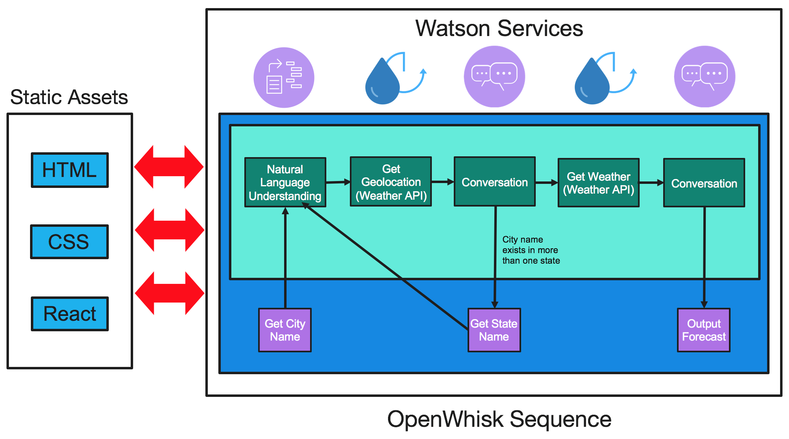
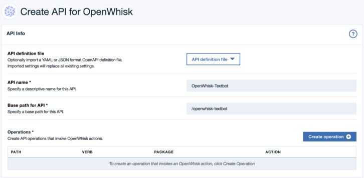
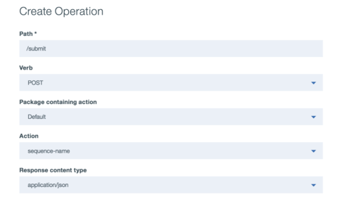

# Watson Weather Chat Bot using OpenWhisk

This project gives you the current weather forecast for your city (U.S. only as of now). The Weather Bot is based off the [Watson Weather Bot](https://github.com/watson-developer-cloud/text-bot) and uses Conversation, Natural Language Understanding, and The Weather Company Data API. It is run with [OpenWhisk](https://console.bluemix.net/openwhisk/).

To see a list of IBM Services, visit here: https://console.bluemix.net/catalog/

## OpenWhisk Action Architecture


## Table of Contents
 - [Getting Started](#getting-started)
   - [Setting up Bluemix and the Watson Services](#setting-up-bluemix-and-the-watson-services)
 - [OpenWhisk Setup](#openwhisk-setup)
   - [Cloudant Integration and Setup](#cloudant-integration-and-setup)
     - [Creating the actions](#creating-the-actions)
     - [Additions to the React app](#additions-to-the-react-app)
   - [Create an API](#create-an-api)
 - [Future Updates](#future-updates)

## Getting Started

### Setting up Bluemix and the Watson Services

1. If you do not already have an existing IBM Bluemix account, sign up [here](https://bluemix.net/).
2. Clone this repository and go to the cloned directory.
   ```none
   git clone https://github.com/eakelly/openwhisk-textbot.git
   cd path/openwhisk-textbot
   ```
3. Download and install the [Cloud-Foundry CLI](https://github.com/cloudfoundry/cli).
   * Alternatively, you can create the necessary services by going to your [Bluemix dashboard](https://console.bluemix.net/dashboard/).
4. Once the CLI has been set up and the repo has been cloned, open a terminal window and connect to Bluemix by doing the following:
   ```none
   cf api https://api.ng.bluemix.net
   cf login
   ```
5. Follow the steps in the README [here](https://github.com/watson-developer-cloud/text-bot) to set up the Conversation, NLU, and Weather Company Data services on Bluemix.

## OpenWhisk Setup

1. Download and install the [OpenWhisk CLI](https://console.bluemix.net/openwhisk/learn/cli), then follow the steps on that page to set up your OpenWhisk Namespace and Authorization Key.

2. You will be creating 5 actions (not including actions for the Cloudant DB) for the weather chat bot as follows:
   ```none
   wsk action create conversation1 actions/conversation.js --web true
   wsk action create conversation2 actions/conversation-weather.js --web true
   wsk action create nlu actions/nlu.js --web true
   wsk action create getGeoLoc actions/getGeoLoc.js --web true
   wsk action create getWeather actions/getWeather.js --web true
   ```
3. Change to the config directory and replace the default parameters with your Watson service credentials. Your credentials can be found by heading to your [Bluemix dashboard](https://console.bluemix.net/dashboard/apps), clicking on the service name, and then the Service Credentials tab.

   **Conversation Credentials**
   ```none
   {
    "CONVERSATION_USERNAME": "<YOUR CONVERSATION SERVICE USERNAME>",
    "CONVERSATION_PASSWORD": "<YOUR CONVERSATION SERVICE PASSWORD>",
    "WORKSPACE_ID": "<YOUR CONVERSATION SERVICE WORKSPACE_ID>"
   }
   ```
   Your workspace ID can be found by going to your [Bluemix dashboard](https://console.bluemix.net/dashboard/apps), clicking on your Conversation service,
   then clicking on the Launch Tool button.

   **NLU Credentials**
   ```none
   {
    "NLU_USERNAME": "<YOUR NLU SERVICE USERNAME>",
    "NLU_PASSWORD": "<YOUR NLU SERVICE PASSWORD>"
   }
   ```
   **Weather Company Data Credentials**
   ```none
   {
    "WEATHER_URL": "<YOUR WEATHER SERVICE URL>",
    "WEATHER_USERNAME": "<YOUR WEATHER SERVICE USERNAME>",
    "WEATHER_PASSWORD": "<YOUR WEATHER NSERVICE PASSWORD>"
   }
   ```
4. Export your service credentials by performing the following:
   ```none
   wsk action update conversation1 --param-file config/conversation-config.json
   wsk action update conversation2 --param-file config/conversation-config.json
   wsk action update nlu --param-file config/nlu-config.json
   wsk action update getGeoLoc --param-file config/weather-config.json
   wsk action update getWeather --param-file config/weather-config.json
   ```
5. Finally, create an OpenWhisk sequence to connect the actions:
   ```none
   wsk action create <sequence name> --sequence nlu,getGeoLoc,conversation1,getWeather,conversation2
   ```

6. Copy and paste the following command in a terminal window and replace <sequence name> with the name of your OpenWhisk sequence. If you get a JSON response with no status error messages, then your sequence has been successfully created.
   ```bash
   wsk action invoke --blocking <sequence name> --param conversation '{ "input": { "text": "Hello", "language": "en" }, "context": {} }'
   ```
  
### Cloudant Integration and Setup

If you do not intend to have database support for your application, then you can skip to the [Create an API](#create-an-api) section.

#### Creating the actions

OpenWhisk actions to use the Cloudant Database have been included, and allow your application to insert, read, and write Watson Conversation contexts to the database. Once set up, the actions will be ready to use but require some additions to the UI to handle database IDs and Revision numbers (for updating documents). Follow the instructions below to create the Cloudant OpenWhisk actions.

1. Open a terminal window and create the 3 Cloudant actions below:
   ```none
   wsk action create cloudant-add actions/cloudant-add.js --web true
   wsk action create cloudant-read actions/cloudant-read.js --web true
   wsk action create cloudant-write actions/cloudant-write.js --web true
   ```
2. Navigate to the config folder and replace the placeholder text with your Cloudant credentials. 

   **CLOUDANT Credentials**
   ```none
   {
    "CLOUDANT_URL": "<YOUR CLOUDANT URL>"
   }
   ```
   Your credentials can be found by heading to your [Bluemix dashboard](https://console.bluemix.net/dashboard/apps), clicking on the Cloudant service name you created, and then the Service Credentials tab. Then, click on the "View credentials" dropdown
   associated with the API key you will use. You will need the URL for your Cloudant DB.

3. Next, export your service credentials by doing the following commands:
   ```none
   wsk action update cloudant-add --param-file config/cloudant-config.json
   wsk action update cloudant-read --param-file config/cloudant-config.json
   wsk action update cloudant-write --param-file config/cloudant-config.json
   ```
4. Finally, create an OpenWhisk sequence to connect all the actions:
   ```none
   wsk action create <sequence name> --sequence cloudant-add,cloudant-read,nlu,getGeoLoc,conversation1,getWeather,conversation2,cloudant-write
   ```
5. You can test your sequence by copying and pasting the following command in a new terminal window.

   ```none
   wsk action invoke --blocking openwhisk-textbot-cloudant --param conversation '{ "input": { "text": "Hello", "language": "en" }, "context": {} }' --param _id test --param _rev null
   ```
   If you get a JSON response with no status error messages, then your sequence has been successfully created.

6. To ensure that your document is saved in your Cloudant DB instance, go to your [Bluemix dashboard](https://console.bluemix.net/dashboard/apps), click on your Cloudant DB service instance, then click on the **Launch** button. Once you are viewing your list of **Databases**, click on the name of your weather bot database. If you see an entry with the same ID number used in the ```wsk``` command, then your sequence has sucessfully written to the database. If you would like to view the context that has been saved, then check the **Include Docs** box at the top of the page.

#### Additions to the React app

* Cloudant integration requires the DB document's ```_id``` and ```_rev``` to be passed in the UI.
* The document ID numbers should be UUIDs. Install the Node [UUID Package](https://www.npmjs.com/package/uuid) and follow the instructions on how to generate the IDs.

## Create an API

1. Go to the [OpenWhisk API Management Console](https://console.bluemix.net/openwhisk/) and then click on .
2. Enter a name for your API and specify a base path:
   
3. Next, click on .
4. Create a POST operation for your API and specify the OpenWhisk sequence created earlier as the Action that will be used:

   
5. In the **Security and Rate Limiting** section, enable the following:
   1. **Application authentication**
   
   2. **CORS**
   
6. Then, click **Save and expose**.
7. Now, create API keys for sharing within Bluemix and outside of Bluemix by clicking .
8. To test your API, navigate to the **API Explorer** tab. Copy and paste the following command in a terminal window. Replace the ```--url``` flag with the route and path for your POST request, and replace the ```default``` API key with yours. To generate an ```id```, click on **Try it**, which is to the right of **Examples**, and then click **Generate** under the **Parameters** section to generate an ID.
   ```bash
   curl --request POST --url <YOUR POST PATH> --header 'accept: application/json' --header 'content-type: application/json' --header 'x-ibm-client-key: <YOUR API KEY>' --data '{"id":<GENERATED ID>, "conversation": { "input": { "text": "Hello", "language": "en"}, "context": {}}}'
   ```

## Future Updates
* ~~Cloudant DB integration and the creation of actions to get and store information within the database~~
* ~~Ability to query a certain day within the 7-day forecast for your city~~
* ~~Build a UI~~
* Output a list of states for the user to choose from should a city name occur in more than one state
* Improve city detection accuracy